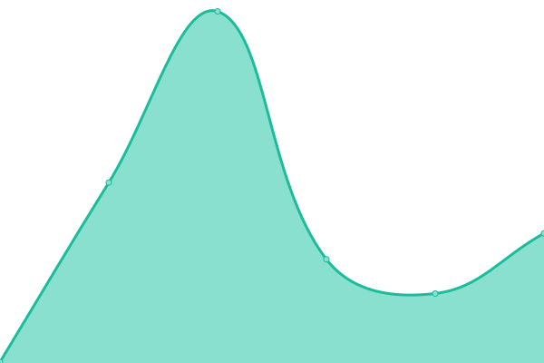
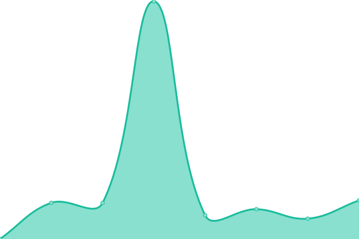
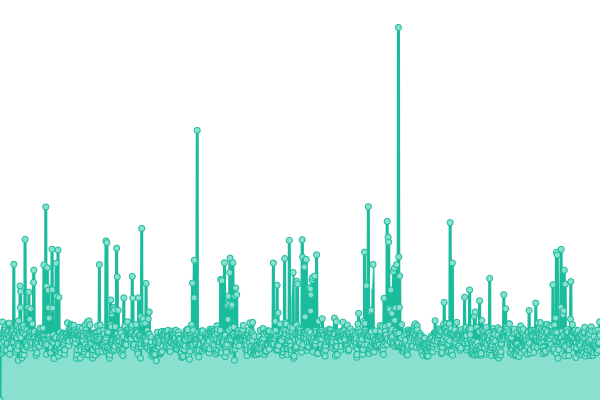

# [📈 Live Status](https://xdncov-mirror-status.lsy223622.com): <!--live status--> **🟧 Partial outage**

This repository contains the open-source uptime monitor and status page for [lsy223622](http://lsy223622.com:2236), powered by [Upptime](https://github.com/upptime/upptime).

With [Upptime](https://upptime.js.org), you can get your own unlimited and free uptime monitor and status page, powered entirely by a GitHub repository. We use [Issues](https://github.com/lsy223622/xdncov-mirror-status/issues) as incident reports, [Actions](https://github.com/lsy223622/xdncov-mirror-status/actions) as uptime monitors, and [Pages](https://xdncov-mirror-status.lsy223622.com) for the status page.

<!--start: status pages-->
<!-- This summary is generated by Upptime (https://github.com/upptime/upptime) -->
<!-- Do not edit this manually, your changes will be overwritten -->
<!-- prettier-ignore -->
| URL | Status | History | Response Time | Uptime |
| --- | ------ | ------- | ------------- | ------ |
|  [Main Site](https://benderblog.github.io/SpiritFlown.html) | 🟩 Up | [main-site.yml](https://github.com/lsy223622/xdncov-mirror-status/commits/HEAD/history/main-site.yml) | 

 101ms
     
 | 

<a href="https://xdncov-mirror-status.lsy223622.com/history/main-site">100.00%</a>
    

|  [Mirror-Ri](https://ncov.raay.xyz/) | 🟩 Up | [mirror-ri.yml](https://github.com/lsy223622/xdncov-mirror-status/commits/HEAD/history/mirror-ri.yml) | 

 1954ms
     
 | 

<a href="https://xdncov-mirror-status.lsy223622.com/history/mirror-ri">99.79%</a>
    

|  [Mirror-木生](https://t.lsy223622.com/ncov-xidian-times) | 🟩 Up | [mirror.yml](https://github.com/lsy223622/xdncov-mirror-status/commits/HEAD/history/mirror.yml) | 

 920ms
     
 | 

<a href="https://xdncov-mirror-status.lsy223622.com/history/mirror">99.80%</a>
    

|  [Mirror-Dimole](https://xidian-ncov.dml.ink/) | 🟩 Up | [mirror-dimole.yml](https://github.com/lsy223622/xdncov-mirror-status/commits/HEAD/history/mirror-dimole.yml) | 

 222ms
     
 | 

<a href="https://xdncov-mirror-status.lsy223622.com/history/mirror-dimole">100.00%</a>
    

|  [Mirror-爬](https://ncov.zhouym.tech/) | 🟩 Up | [mirror.yml](https://github.com/lsy223622/xdncov-mirror-status/commits/HEAD/history/mirror.yml) | 

 920ms
     
 | 

<a href="https://xdncov-mirror-status.lsy223622.com/history/mirror">99.80%</a>
    

|  [Mirror-xmgg](https://myxdu.moefactory.com/ncov/doc) | 🟩 Up | [mirror-xmgg.yml](https://github.com/lsy223622/xdncov-mirror-status/commits/HEAD/history/mirror-xmgg.yml) | 

 1260ms
     
 | 

<a href="https://xdncov-mirror-status.lsy223622.com/history/mirror-xmgg">100.00%</a>
    

|  [Mirror-鱼露](https://ncov.hawa130.com/) | 🟩 Up | [mirror.yml](https://github.com/lsy223622/xdncov-mirror-status/commits/HEAD/history/mirror.yml) | 

 920ms
     
 | 

<a href="https://xdncov-mirror-status.lsy223622.com/history/mirror">99.80%</a>
    

|  [Mirror-没有女朋友跨年的群傻逼](https://x.ksfu.top/) | 🟩 Up | [mirror.yml](https://github.com/lsy223622/xdncov-mirror-status/commits/HEAD/history/mirror.yml) | 

 920ms
     
 | 

<a href="https://xdncov-mirror-status.lsy223622.com/history/mirror">99.80%</a>
    

|  [Mirror-noobwei](https://www.noobwei.xyz/COVID-19.html) | 🟥 Down | [mirror-noobwei.yml](https://github.com/lsy223622/xdncov-mirror-status/commits/HEAD/history/mirror-noobwei.yml) | 

 845ms
     
 | 

<a href="https://xdncov-mirror-status.lsy223622.com/history/mirror-noobwei">0.00%</a>
    

<!--end: status pages-->

[**Visit our status website →**](https://xdncov-mirror-status.lsy223622.com)

## 📄 License

- Powered by: [Upptime](https://github.com/upptime/upptime)
- Code: [MIT](./LICENSE) © [lsy223622](http://lsy223622.com:2236)
- Data in the `./history` directory: [Open Database License](https://opendatacommons.org/licenses/odbl/1-0/)
